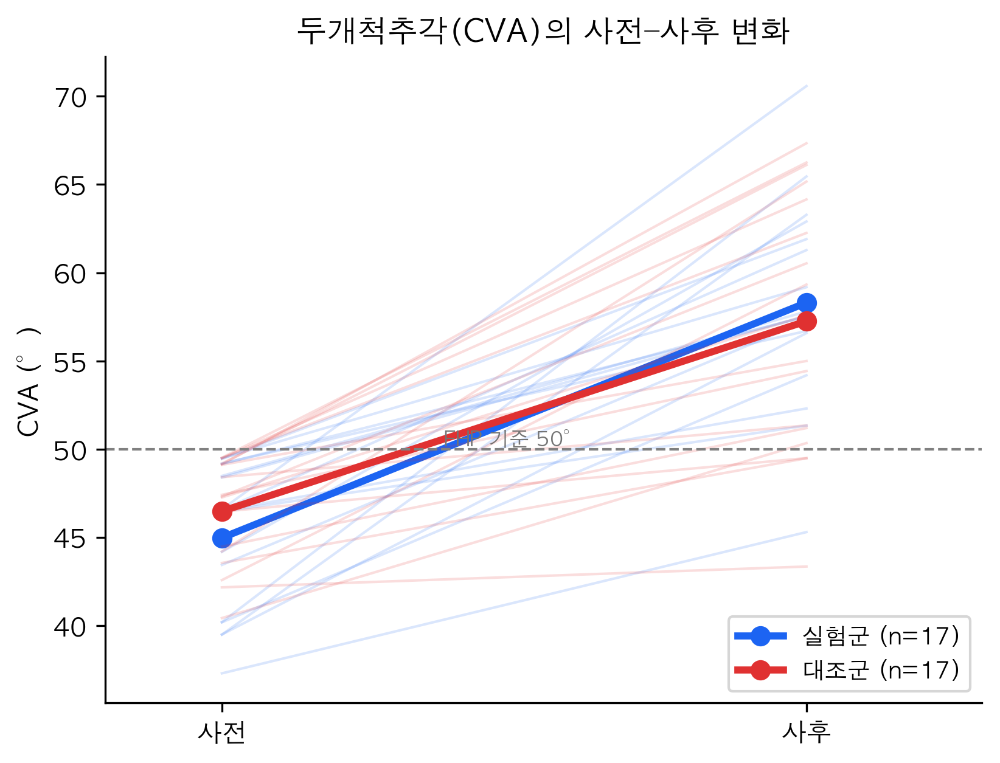
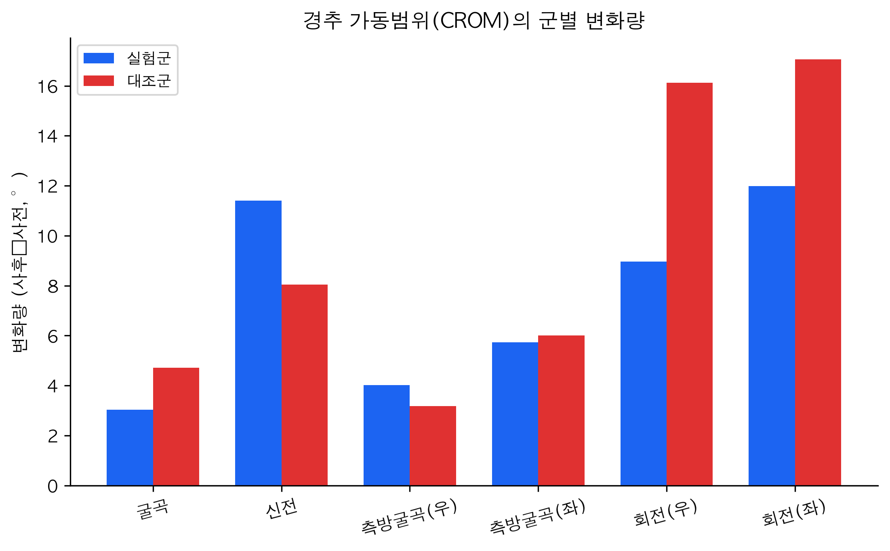
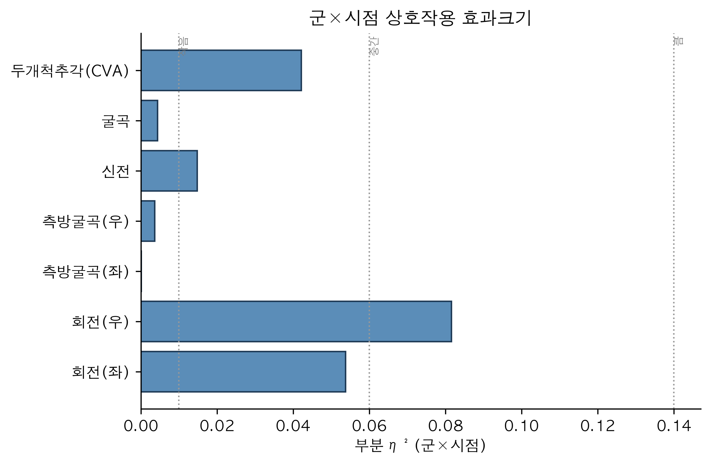

# AI 생성 운동 프로그램이 전방머리자세 대학생의 두개척추각과 경추 가동범위에 미치는 효과: 무작위대조시험

**Effects of an AI-Generated Exercise Program on Craniovertebral Angle and Cervical Range of Motion in University Students with Forward Head Posture: A Randomized Controlled Trial**

강준환 · 김강현 · 김서윤 · 박지원 · 오영인 · 이채은  
*지도교수: 최완석*  
경운대학교 물리치료학과

---

## 국문초록

**목적.** 본 연구의 목적은 대상 집단의 평균 특성을 반영하여 인공지능(artificial intelligence, AI)이 생성한 운동 프로그램이 기존의 표준 임상 운동 프로그램과 비교하여 전방머리자세(forward head posture, FHP) 대학생의 두개척추각(craniovertebral angle, CVA)과 경추 가동범위(cervical range of motion, CROM) 개선에 더 효과적인지 검증하는 데 있다.

**방법.** FHP(CVA<50°)를 가진 대학생 40명을 AI 생성 운동군(n=20)과 표준 임상 운동군(n=20)에 무작위 배정하였다. 중재는 5주간 주 2회, 회기당 20분씩 총 10회기 시행하였다. CVA와 6방향 CROM(굴곡, 신전, 좌·우 측방굴곡, 좌·우 회전)을 중재 전·후에 측정하였으며, 사전·사후 자료가 모두 확보된 34명(군당 17명)을 분석하였다. 군(2)×시점(2) 반복측정 이원분산분석을 시행하였다.

**결과.** 두 군은 모든 사전 변수에서 유의한 차이가 없었다(p>0.05). CVA는 시점의 주효과가 유의하여(F(1,32)=125.41, p<.001, partial η²=0.80) 두 군 모두 중재 후 유의하게 증가하였다(실험군 45.0→58.3°, 대조군 46.5→57.3°). CROM은 5개 방향에서 시점의 주효과가 유의하였다. 그러나 측정한 모든 변수에서 군×시점 상호작용은 유의하지 않았으며(CVA: F=1.41, p=.244, partial η²=0.042), 중재 후 변화량의 군간 차이도 통계적으로 유의하지 않았다.

**결론.** AI가 생성한 운동 프로그램은 표준 임상 운동 프로그램에 비해 통계적으로 유의하게 더 큰 개선을 보이지는 않았으며, 두 프로그램 모두 FHP 대학생의 CVA와 CROM을 유사한 수준으로 개선하였다. 이는 AI 생성 운동 프로그램이 표준 임상 운동에 상응하는 효과를 가지면서 접근성과 확장성이 높은 대안적 중재가 될 수 있음을 시사한다.

**주요어:** 전방머리자세, 인공지능, 운동 프로그램, 두개척추각, 경추 가동범위, 대규모 언어모델

## Abstract

Purpose: This study compared the effects of an AI-generated exercise program, which incorporated group-specific characteristics, with a conventional clinical exercise program on craniovertebral angle (CVA) and cervical range of motion (CROM) in university students with forward head posture (FHP). Methods: A total of 40 university students with FHP (CVA<50°) were randomly assigned to an AI-generated exercise group (n=20) or a conventional clinical exercise group (n=20). Interventions were performed twice weekly for 5 weeks (10 sessions, 20 min each). CVA and CROM in six directions were measured before and after the intervention, and 34 participants (17 per group) with complete data were analyzed using a 2(group)×2(time) repeated-measures ANOVA. Results: The groups were homogeneous at baseline (all p>0.05). A significant main effect of time was found for CVA (F=125.41, p<.001, partial η²=0.80), with both groups improving after the intervention. However, no significant group×time interaction was observed for any outcome (CVA: F=1.41, p=0.244), and between-group differences in change were not significant. Conclusion: The AI-generated exercise program did not produce significantly greater improvement than the conventional program; both improved CVA and CROM comparably. The AI-generated program may serve as an accessible alternative with effects comparable to expert-designed clinical exercise.

**Key words:** Forward head posture, Artificial intelligence, Exercise program, Craniovertebral angle, Cervical range of motion, Large language model

---

## Ⅰ. 서론

전방머리자세(forward head posture, FHP)는 머리가 경추에 비해 전방으로 돌출된 자세이상으로, 두개척추각(craniovertebral angle, CVA)이 50° 미만일 때 진단된다[1]. 스마트폰과 컴퓨터 사용의 급격한 증가는 현대인의 경추 정렬에 영향을 미치는 주요 환경 요인으로 작용하고 있으며, FHP는 이러한 디지털 환경의 확산 속에서 임상적·사회적 주목을 받는 대표적인 자세 이상으로 부각되고 있다. 특히 현대 대학생에서 FHP 유병률이 급격히 증가하고 있으며, 약 73%에 이르는 것으로 보고되었다[2]. FHP는 경부통, 두통, 견갑부 불편감 등 다양한 근골격계 문제와 연관되며[3,4], 장시간 컴퓨터 사용자에서는 자세 균형 저하와도 관련이 있다[5].

FHP의 병태생리학적 기전은 근육 불균형에 기인한다. Janda(1994)의 상교차증후군(upper crossed syndrome) 모델에 따르면[6], 심경부굴곡근(deep cervical flexors), 경추신전근(cervical erector spinae), 하부승모근(lower trapezius), 능형근(rhomboids)은 약화되는 반면, 상부승모근(upper trapezius), 견갑거근(levator scapulae), 사각근(scalenes), 흉쇄유돌근(sternocleidomastoid), 후두하근(suboccipitals)은 과활성화되어 자세 변형을 유발한다. 이러한 상교차증후군 패턴은 경추의 정상적인 전만 감소와 상부 경추의 과신전을 초래한다[7]. 이 기전을 토대로 FHP 교정을 위한 치료적 운동의 효과는 체계적 문헌고찰을 통해 입증되었으며, Sheikhhoseini 등[8]의 메타분석에서는 7개 무작위대조시험(총 627명)을 분석한 결과 교정운동이 CVA(p=.0005) 및 통증(p<.001)에 유의한 개선 효과를 보였다. 그러나 기존 연구들은 대부분 일반적인 FHP 환자를 대상으로 표준화된 운동 프로토콜을 적용하였으며, 특정 대상 집단의 고유한 특성을 고려하여 운동 프로그램을 최적화한 연구는 제한적이었다[9].

이러한 공백을 보완할 수 있는 대안으로 최근 인공지능(artificial intelligence, AI) 기술의 발전이 주목받고 있다[10]. 특히 대규모 언어모델(large language model, LLM) 기반 AI는 방대한 의학 문헌을 학습하여 근거 기반의 운동 프로그램을 생성할 수 있다. 생성형 AI 모델은 FITT 원칙과 ACSM 가이드라인에 부합하는 운동 프로그램을 생성할 수 있으며, 특정 대상 집단의 특성을 입력받아 개인화된 운동 처방을 제공할 가능성이 제기되었다[11]. 또한 GPT-4 모델이 다양한 건강 상태를 가진 환자 프로필에 대해 일반적 운동 가이드라인에 부합하는 프로그램을 생성할 수 있음이 비판적으로 평가된 바 있다[12]. 그러나 현재까지 생성형 AI가 생성한 운동 프로그램은 대부분 일반적인 건강 증진이나 만성질환 관리를 대상으로 하였으며, FHP와 같은 특정 근골격계 자세 이상의 교정을 목적으로 AI 생성 운동의 효과를 기존 전문가 설계 운동과 직접 비교한 무작위대조시험은 보고된 바 없다.

이에 본 연구의 목적은 대상 집단의 평균 특성을 반영하여 AI가 생성한 운동 프로그램이 기존의 표준 임상 운동법과 비교하여 FHP 대학생의 CVA 및 CROM 개선에 더 효과적인지 검증하는 데 있다. 본 연구의 귀무가설(H0)은 'AI 생성 운동군과 표준 임상 운동군 간에 CVA 및 CROM 개선에 통계적으로 유의한 차이가 없을 것이다'이며, 대립가설(H1)은 'AI 생성 운동군이 표준 임상 운동군에 비해 CVA 및 CROM에서 통계적으로 유의하게 더 큰 개선을 보일 것이다'로 설정하였다.

## Ⅱ. 연구방법

### 1. 연구 대상자

본 연구는 FHP 교정을 위한 AI 생성 운동 프로그램의 효과를 표준 임상 운동 프로그램과 비교 검증하기 위한 평가자 맹검(assessor-blinded), 평행군(parallel-group) 무작위대조시험(randomized controlled trial, RCT)으로 설계되었다. 표본 크기는 G*Power 3.1.9.7(University of Düsseldorf, Düsseldorf)을 이용하여 산출하였다. FHP 교정 운동 중재의 메타분석[8]에서 CVA에 대해 큰 효과크기가 보고된 점, 그리고 capital flexion exercise를 적용한 선행 연구[13]에서 CVA 개선에 대해 d=1.34(p=0.002)의 효과크기가 확인된 점을 근거로 하였다. 효과크기 d=1.0, 유의수준 α=0.05, 검정력(1−β)=0.80, 양측검정 조건의 독립표본 t-검정을 기준으로 산정한 결과 군당 17명이 요구되었으며, 약 15%의 탈락률을 고려하여 군당 20명, 총 40명의 대상자를 모집하였다.

선정 기준은 (1) 사전 측정에서 CVA가 50° 미만으로 FHP에 해당하는 대학생[1,13], (2) 최근 6개월 이내 경부 관련 치료 병력이 없는 자, (3) 경추 외상 또는 수술 병력이 없는 자, (4) 연구의 목적과 절차에 대한 충분한 설명을 듣고 자발적으로 서면 동의한 자로 하였다. 제외 기준은 (1) 경추 또는 상지에 방사통, 감각 이상, 근력 약화 등의 신경학적 증상을 호소하는 자, (2) 최근 3개월 이내 경부 통증으로 약물 치료 또는 물리치료를 받은 자, (3) 추간판 탈출증, 척추관 협착증 등 중증 척추 질환을 진단받은 자로 하였다.

### 2. 연구 절차

본 연구의 전반적 절차는 CONSORT(Consolidated Standards of Reporting Trials) 지침에 준하여 수행되었다. 연구 참여 전 모든 잠재적 대상자에게 연구의 목적, 절차, 잠재적 위험 및 이익에 대해 구두 및 서면으로 충분히 설명한 후, 자발적 참여 의사를 확인하고 서면 동의서를 취득하였다.

사전 평가가 완료된 후, 평가에 참여하지 않은 제3의 연구자가 컴퓨터 기반 난수 생성 프로그램(randomizer.org)을 이용하여 대상자를 AI 생성 운동군(experimental group, n=20)과 표준 임상 운동군(control group, n=20)에 1:1 비율로 무작위 배정하였다. 평가자 맹검을 유지하기 위해 중재에 관여하지 않은 물리치료학과 3학년 재학생 2인이 사전·사후 측정을 전담하였으며, 측정자는 대상자의 군 배정 정보에 접근할 수 없도록 통제하였다. 사전 측정과 사후 측정은 동일한 측정자가 동일한 장소에서 표준화된 절차에 따라 수행하였다.

### 3. 중재 방법

중재는 5주간 주 2회, 총 10회기에 걸쳐 연구자의 직접 감독 하에 시행되었다. 회기당 운동 수행 시간은 실험군과 대조군 모두 20분으로 동일하게 통제하였다.

**1) 실험군 운동 프로그램**

실험군에는 LLM 기반 생성형 AI 챗봇인 Claude Opus 4.5(Anthropic, San Francisco, CA, USA)가 생성한 운동 프로그램을 적용하였다. 연구자는 2026년 4월 공식 웹 인터페이스(https://claude.ai)에 접속하여 기본 설정 상태에서 표준화된 프롬프트를 입력하였다. 해당 프롬프트에는 대상자 집단의 평균 CVA, 평균 CROM(6방향), 평균 일일 스마트폰 사용 시간, 평균 시각상사척도(visual analogue scale, VAS) 통증 점수 및 주요 증상이 변수로 포함되었으며, 프롬프트 전문은 부록(Appendix 1)에 제시하였다. AI 출력의 재현성을 확보하기 위해 동일한 프롬프트를 독립된 신규 채팅 세션에서 3회 반복 입력하여 생성된 결과 간의 일관성을 확인하였다. 이후 3개의 후보 프로그램에 대해 연구진이 (1) 운동의 안전성, (2) FHP 교정과의 관련성, (3) 도구 없이 맨몸으로 수행 가능 여부의 세 가지 기준으로 임상적 적합성을 검토하여 최종 프로그램을 선정하였다. 최종 선정된 운동의 빈도, 수행 방법, 시간, 대상 근육에 관한 세부 사항은 Table 1에 제시하였다.

**Table 1. 실험군(AI 생성) 운동 프로그램**

| 운동 | 방법 | 대상 근육 | 용량 |
|---|---|---|---|
| 운동 1 | [AI 생성 운동 프로그램 최종본의 운동명·방법·세트/반복을 입력] | [대상 근육] | [용량] |
| 운동 2 | [ 〃 ] | [대상 근육] | [용량] |
| 운동 3 | [ 〃 ] | [대상 근육] | [용량] |

**2) 대조군 운동 프로그램**

대조군에는 FHP 교정에 대한 효과가 선행 연구에서 입증된 표준화된 임상 운동 프로그램을 적용하였다. 본 프로그램은 운동학적 근거[7]에 따라 FHP 개선에 효과적인 것으로 알려진 경추신전근 스트레칭(cervical extensor stretching)과 대흉근 스트레칭(pectoralis major stretching), 그리고 임상 연구[14]에서 그 효과가 입증된 맥켄지 신전 운동(McKenzie extension exercise)의 3가지 운동으로 구성되었다. 각 운동의 빈도, 방법, 시간 및 대상 근육에 관한 세부 사항은 Table 2에 제시하였다.

**Table 2. 대조군(표준 임상) 운동 프로그램**

| 운동 | 방법 | 대상 근육 | 용량 |
|---|---|---|---|
| 경추 신전근 스트레칭 | 앉은 자세에서 턱을 가슴 쪽으로 당기며 목 뒤를 신전 | 후두하근, 상부승모근 | 20–30초, 4세트 |
| 대흉근 스트레칭 | 벽에 팔꿈치를 90° 굴곡하여 대고 몸을 앞으로 밀어 흉근을 신전 | 대흉근, 소흉근 | 20–30초, 4세트 |
| 맥켄지 신전 운동 | 복와위에서 양손을 어깨 옆에 놓고 상체를 천천히 들어 올려 경추 및 흉추 신전 유도 | 경추신전근 및 후경부 근육 | 3회, 8세트 |

**3) 중재 충실도 관리**

중재 충실도(intervention fidelity)를 확보하기 위해 매 회기마다 연구자가 직접 운동 수행을 관찰하였으며, 운동 자세에 오류가 관찰될 경우 즉각적인 피드백을 제공하여 정확한 수행을 유도하였다. 출석 여부는 회기별로 운동 일지에 기록하였으며, 출석률이 80% 미만(전체 10회기 중 8회기 미만 참여)인 대상자는 탈락(drop-out)으로 처리하였다.

### 4. 평가 방법

모든 평가는 중재 전(pre-intervention)과 중재 5주 후(post-intervention) 동일한 환경에서 동일한 측정자에 의해 수행되었다. 주요 측정 변수는 CVA 및 CROM(6방향)이었다. 측정자는 근골격계 평가 관련 교과목을 이수한 물리치료학과 3학년 재학생 2인으로, 본 연구 개시 전 측정 프로토콜에 대한 사전 훈련을 거친 후 측정에 투입되었다.

**1) 두개척추각(CVA)**

CVA는 사진 측정법(photogrammetry)을 이용하여 산출하였다. 영상 획득에는 스마트폰 카메라(iPhone 15, Apple Inc., Cupertino, CA, USA)를 사용하였으며, 대상자의 측면으로부터 1.4 m 떨어진 위치에 삼각대를 설치하여 카메라를 고정하였고, 카메라 렌즈는 대상자가 앉은 자세에서 어깨 높이와 수평이 되도록 조절하였다[15]. 자세 재설정(postural resetting)을 위해 대상자에게 경추를 최대 굴곡 후 최대 신전하는 동작을 3회 반복하게 한 뒤, 전방을 응시하며 자연스럽고 편안한 자세를 유지하도록 표준화된 지시문을 제공하였다. 해부학적 지표인 이주(tragus)와 제7경추 극돌기(C7 spinous process)에 적색 수성 마커로 표지점을 표시한 후 측면 이미지를 획득하였다. CVA는 C7 극돌기 표지점과 이주 표지점을 연결한 선과 C7 극돌기를 지나는 수평선이 이루는 각도로 정의하였으며, ImageJ 소프트웨어(National Institutes of Health, Bethesda, MD, USA)를 이용하여 산출하였다. 사진 측정법을 이용한 CVA 측정의 측정자 내 신뢰도는 ICC=0.98로 보고된 바 있다[16]. 측정 오차를 최소화하기 위해 3회 반복 측정한 값의 평균을 분석에 사용하였다.

**2) 경추 가동범위(CROM)**

CROM은 범용 각도계(universal goniometer)를 이용하여 굴곡(flexion), 신전(extension), 좌·우 측방굴곡(lateral flexion), 좌·우 회전(rotation)의 6방향에 대한 능동 가동범위를 측정하였다. 대상자는 등받이가 있는 의자에 골반과 체간을 바르게 정렬한 앉은 자세에서 측정을 수행하였다. 측정 중 체간 및 어깨의 보상 움직임을 최소화하도록 지시하였으며, 각 방향에 대해 3회 측정한 값의 평균을 분석에 사용하였다. 범용 각도계를 이용한 CROM 측정의 신뢰도는 측정자 내 ICC≥0.986, 측정자 간 ICC≥0.947로 보고되었다[17].

### 5. 분석 방법

모든 통계 분석은 SPSS Statistics version 26.0(IBM Corp., Armonk, NY, USA) 및 Python 3(SciPy)을 이용하여 수행하였다. 연구 대상자의 일반적 특성은 기술통계(평균±표준편차 또는 빈도)로 제시하였다. 자료의 정규성은 Shapiro-Wilk 검정으로 확인하였다. 두 군 간 사전 동질성 검정은 연속형 변수의 경우 정규성을 만족할 때 독립표본 t-검정을, 정규성을 만족하지 않을 경우 Mann-Whitney U 검정을 적용하였으며, 범주형 변수는 카이제곱 검정(χ² test)을 적용하였다.

중재 효과의 검정을 위해 군(2: 실험군, 대조군)×시점(2: 사전, 사후)의 반복측정 이원분산분석(two-way repeated measures ANOVA)을 실시하였으며, 유의한 상호작용 효과가 관찰된 경우 Bonferroni 보정을 적용한 사후 검정을 수행하기로 하였다. 군내 사전-사후 변화는 대응표본 t-검정으로, 군간 변화량 차이는 독립표본 t-검정으로 검정하였다. 효과크기는 분산분석에 대해 부분 에타제곱(partial η²)으로 산출하였으며, 0.01은 작은 효과, 0.06은 중간 효과, 0.14는 큰 효과로 해석하였다. 일반적 특성은 무작위 배정된 전체 대상자를 대상으로 보고하였고, 중재 효과 분석은 사전·사후 자료가 모두 확보된 대상자를 대상으로 수행하였다. 모든 통계적 유의수준은 양측검정 α=0.05로 설정하였다.

## Ⅲ. 연구결과

### 1. 연구 대상자의 일반적 특성

총 40명이 무작위 배정되었다(실험군 20명, 대조군 20명). 이 중 중재 또는 사후 측정 과정에서 사전 또는 사후 자료가 확보되지 않은 6명(각 군 3명)을 제외하고, 사전·사후 자료가 모두 확보된 34명(실험군 17명, 대조군 17명)을 중재 효과 분석에 포함하였다. 연구 대상자의 일반적 특성은 Table 3과 같다. 성별, 나이, 신장, 체중, 통증(VAS), 스마트폰 사용시간 등 모든 변수에서 두 군 간 유의한 차이가 없어 집단의 동질성이 확보되었다(모두 p>0.05). 또한 분석에 포함된 대상자의 모든 결과변수 사전값에서도 군간 유의한 차이가 없었다(모두 p>0.05).

**Table 3. 연구 대상자의 일반적 특성 및 사전 동질성 검정**

| 변수 | 실험군(n=20) | 대조군(n=20) | 검정 | p |
|---|---|---|---|---|
| 성별 (남/여) | 14/6 | 15/5 | χ² | 1.000 |
| 나이 (세) | 20.00±1.26 | 20.30±1.56 | Z | 0.626 |
| 신장 (cm) | 171.70±8.14 | 172.55±8.83 | t | 0.753 |
| 체중 (kg) | 79.65±19.27 | 78.20±16.94 | t | 0.802 |
| 통증 (VAS) | 1.60±1.14 | 1.75±1.41 | Z | 0.822 |
| 스마트폰 사용 (시간/일) | 4.97±2.24 | 4.75±1.43 | Z | 0.792 |

*값은 평균±표준편차 또는 빈도. t: 독립표본 t-검정, Z: Mann-Whitney U 검정, χ²: 카이제곱 검정.*

### 2. CVA 및 CROM의 군내 변화

CVA 및 CROM의 군내 사전-사후 변화는 Table 4와 같다. CVA는 실험군에서 44.98±4.16°에서 58.30±5.85°로(Δ=+13.32°, p<.001), 대조군에서 46.49±2.98°에서 57.26±7.32°로(Δ=+10.77°, p<.001) 두 군 모두 중재 후 유의하게 증가하였다. CROM의 경우 실험군에서는 신전, 측방굴곡(우), 측방굴곡(좌), 회전(우), 회전(좌)에서 유의한 개선이 나타났으며, 대조군에서는 신전, 회전(우), 회전(좌)에서 유의한 개선이 관찰되었다.

**Table 4. 결과변수의 사전·사후 값 및 군내 변화 (단위: °)**

| 결과변수 | 군 | 사전 | 사후 | Δ | p |
|---|---|---|---|---|---|
| 두개척추각(CVA) | 실험군 | 44.98±4.16 | 58.30±5.85 | +13.32 | <0.001*** |
| 두개척추각(CVA) | 대조군 | 46.49±2.98 | 57.26±7.32 | +10.77 | <0.001*** |
| 굴곡 | 실험군 | 32.95±10.86 | 35.97±10.28 | +3.02 | 0.242n.s. |
| 굴곡 | 대조군 | 35.11±8.36 | 39.82±12.93 | +4.71 | 0.221n.s. |
| 신전 | 실험군 | 40.75±13.61 | 52.15±10.96 | +11.40 | 0.005** |
| 신전 | 대조군 | 41.71±11.34 | 49.76±13.08 | +8.05 | 0.026* |
| 측방굴곡(우) | 실험군 | 32.38±9.55 | 36.40±9.11 | +4.02 | 0.030* |
| 측방굴곡(우) | 대조군 | 32.70±6.08 | 35.88±9.29 | +3.18 | 0.095n.s. |
| 측방굴곡(좌) | 실험군 | 32.81±10.30 | 38.54±10.52 | +5.73 | 0.049* |
| 측방굴곡(좌) | 대조군 | 31.38±8.92 | 37.39±14.17 | +6.01 | 0.055n.s. |
| 회전(우) | 실험군 | 49.25±14.33 | 58.22±9.10 | +8.96 | 0.005** |
| 회전(우) | 대조군 | 43.23±6.04 | 59.35±12.10 | +16.12 | <0.001*** |
| 회전(좌) | 실험군 | 46.86±15.27 | 58.84±9.97 | +11.98 | <0.001*** |
| 회전(좌) | 대조군 | 42.91±6.53 | 59.98±9.76 | +17.07 | <0.001*** |

*Δ: 변화량(사후−사전). \* p<0.05, \*\* p<0.01, \*\*\* p<0.001(대응표본 t-검정).*

*그림 1. 두개척추각(CVA)의 사전–사후 변화(개인 궤적 및 군 평균)*

### 3. 군×시점 반복측정 분산분석

군×시점 반복측정 이원분산분석 결과는 Table 5와 같다. CVA에서 시점의 주효과가 유의하였으며(F(1,32)=125.41, p<.001, partial η²=0.797, 큰 효과크기), 이는 두 군 모두 중재 후 CVA가 개선되었음을 의미한다. CROM에서도 신전, 측방굴곡(우), 측방굴곡(좌), 회전(우), 회전(좌) 방향에서 시점의 주효과가 유의하였다. 반면 군×시점 상호작용은 측정한 모든 변수에서 통계적으로 유의하지 않았으며(CVA: F=1.41, p=.244, partial η²=0.042), 군의 주효과 또한 모든 변수에서 유의하지 않았다. 즉, 중재에 따른 개선의 양상이 두 군 간에 다르지 않았다.

**Table 5. 군(2)×시점(2) 반복측정 이원분산분석 결과**

| 결과변수 | 효과 | F | p | partial η² | 효과크기 |
|---|---|---|---|---|---|
| 두개척추각(CVA) | 시점 | 125.41 | <0.001*** | 0.797 | 큰 |
| 두개척추각(CVA) | 군 | 0.02 | 0.877n.s. | 0.001 | 미미한 |
| 두개척추각(CVA) | 군×시점 | 1.41 | 0.244n.s. | 0.042 | 작은 |
| 굴곡 | 시점 | 3.01 | 0.093n.s. | 0.086 | 중간 |
| 굴곡 | 군 | 1.05 | 0.313n.s. | 0.032 | 작은 |
| 굴곡 | 군×시점 | 0.14 | 0.708n.s. | 0.004 | 미미한 |
| 신전 | 시점 | 16.18 | <0.001*** | 0.336 | 큰 |
| 신전 | 군 | 0.04 | 0.837n.s. | 0.001 | 미미한 |
| 신전 | 군×시점 | 0.48 | 0.493n.s. | 0.015 | 작은 |
| 측방굴곡(우) | 시점 | 8.58 | 0.006** | 0.212 | 큰 |
| 측방굴곡(우) | 군 | 0.00 | 0.971n.s. | 0.000 | 미미한 |
| 측방굴곡(우) | 군×시점 | 0.12 | 0.735n.s. | 0.004 | 미미한 |
| 측방굴곡(좌) | 시점 | 8.78 | 0.006** | 0.215 | 큰 |
| 측방굴곡(좌) | 군 | 0.16 | 0.695n.s. | 0.005 | 미미한 |
| 측방굴곡(좌) | 군×시점 | 0.01 | 0.944n.s. | 0.000 | 미미한 |
| 회전(우) | 시점 | 34.91 | <0.001*** | 0.522 | 큰 |
| 회전(우) | 군 | 0.64 | 0.430n.s. | 0.020 | 작은 |
| 회전(우) | 군×시점 | 2.84 | 0.102n.s. | 0.082 | 중간 |
| 회전(좌) | 시점 | 59.34 | <0.001*** | 0.650 | 큰 |
| 회전(좌) | 군 | 0.19 | 0.665n.s. | 0.006 | 미미한 |
| 회전(좌) | 군×시점 | 1.82 | 0.187n.s. | 0.054 | 작은 |

*partial η²: 0.01 작은, 0.06 중간, 0.14 큰 효과. n.s.: 유의하지 않음.*

*그림 2. 경추 가동범위(CROM)의 군별 변화량*

*그림 3. 군×시점 상호작용의 효과크기(부분 η²)*

### 4. 변화량의 군간 비교

중재 전·후 변화량의 군간 비교 결과는 Table 6과 같다. 모든 결과변수에서 변화량의 군간 차이는 통계적으로 유의하지 않았으며, 95% 신뢰구간이 모두 0을 포함하였다. 주요 결과변수인 CVA의 변화량 차이는 +2.55°(95% CI -1.83~+6.93°, t=1.19, p=.244, Cohen's d=+0.41)로 작은 수준이었다. 따라서 AI 생성 운동군이 표준 임상 운동군에 비해 더 큰 개선을 보일 것이라는 대립가설(H1)은 지지되지 않았다.

**Table 6. 중재 전·후 변화량의 군간 비교 (독립표본 t-검정)**

| 결과변수 | 변화량 차이(실험−대조) | 95% CI | t | p | Cohen's d |
|---|---|---|---|---|---|
| 두개척추각(CVA) | +2.55 | [-1.83, +6.93] | 1.19 | 0.244n.s. | +0.41 |
| 굴곡 | -1.69 | [-10.78, +7.40] | -0.38 | 0.708n.s. | -0.13 |
| 신전 | +3.35 | [-6.49, +13.20] | 0.69 | 0.493n.s. | +0.24 |
| 측방굴곡(우) | +0.84 | [-4.17, +5.85] | 0.34 | 0.735n.s. | +0.12 |
| 측방굴곡(좌) | -0.28 | [-8.35, +7.79] | -0.07 | 0.944n.s. | -0.02 |
| 회전(우) | -7.16 | [-15.81, +1.49] | -1.69 | 0.102n.s. | -0.58 |
| 회전(좌) | -5.09 | [-12.77, +2.59] | -1.35 | 0.187n.s. | -0.46 |

## Ⅳ. 고찰

본 연구는 FHP를 가진 대학생을 대상으로 대상 집단의 평균 특성을 반영한 AI 생성 운동 프로그램과 표준 임상 운동 프로그램의 효과를 비교하였다. 주요 결과는 두 군 모두 중재 후 CVA와 대부분의 CROM 방향에서 유의한 개선을 보였으나, 그 개선 정도에서 군간 유의한 차이가 없었다는 점이다. 이에 따라 AI 생성 운동이 표준 임상 운동보다 우월할 것이라는 대립가설은 기각되었고, 두 중재가 유사한 수준의 효과를 나타냄을 확인하였다.

두 운동 프로그램 모두에서 관찰된 CVA의 큰 개선(부분 η²=0.80)은 선행 연구와 일치한다. Sheikhhoseini 등[8]의 메타분석은 교정운동이 CVA를 유의하게 개선함을 보고하였으며, Janda의 상교차증후군 모델[6]과 경추 운동학[7]은 심경부굴곡근 강화와 단축근 신장이 머리의 전방 전위를 감소시키는 기전을 설명한다. 본 연구의 두 프로그램 또한 이러한 공통된 운동 요소를 포함하였으므로 유사한 기전을 통해 자세가 개선된 것으로 해석된다. 또한 capital flexion exercise[13]와 맥켄지 신전 운동[14]이 CVA 및 경추 정렬 개선에 효과적이라는 보고는 본 연구 대조군의 결과를 뒷받침한다.

CROM의 경우 신전과 좌·우 회전에서 두 군 모두 비교적 큰 시점 효과가 관찰된 반면, 굴곡에서는 유의한 변화가 나타나지 않았다. 이는 본 연구의 중재가 단축된 후경부 신전근의 신장과 경추 신전 가동성 회복에 초점을 둔 운동 요소를 공통적으로 포함한 데 따른 것으로 보이며, 굴곡 가동범위는 상대적으로 변화가 작았던 것으로 해석된다.

본 연구의 핵심 발견은 AI가 생성한 운동 프로그램의 효과가 임상 전문가가 설계한 표준 운동 프로그램과 통계적으로 유의한 차이를 보이지 않았다는 점이다. 이는 LLM 기반 생성형 AI가 집단의 평균 특성을 반영하여 근거 기반 운동 요소를 적절히 포함한 프로그램을 생성할 수 있음을 시사하며, 생성형 AI의 운동 처방 활용 가능성을 제시한 선행 보고[11,12]와 맥을 같이 한다. 특히 전문가 접근이 제한적인 환경에서 AI 생성 운동 프로그램은 접근성과 확장성이 높은 자가관리 보조 수단으로서 임상적 의의를 가질 수 있다.

다만 군×시점 상호작용과 변화량의 군간 차이가 유의하지 않았다는 결과를 '두 중재가 동등하다'로 해석할 때에는 주의가 필요하다. 본 연구는 비열등성(non-inferiority) 또는 동등성 검정을 목적으로 설계되지 않았고 표본수가 제한적이어서, 존재할 수 있는 군간 차이를 검출할 통계적 검정력이 충분하지 않았을 수 있다. 따라서 본 결과는 '유의한 차이를 발견하지 못하였다'로 해석하는 것이 타당하며, 두 중재의 동등성을 확정하기 위해서는 비열등성 설계의 대규모 연구가 필요하다.

본 연구의 제한점은 다음과 같다. 첫째, 사전·사후 자료가 모두 확보된 최종 분석 대상이 34명으로 표본수가 작고 6명의 자료 누락이 발생하여 검정력에 제약이 있었다. 둘째, 중재 기간이 5주로 비교적 짧고 추적관찰이 이루어지지 않아 장기 효과를 확인하지 못하였다. 셋째, 대상이 단일 대학의 대학생에 국한되어 결과를 일반화하는 데 한계가 있다. 넷째, AI 생성 운동 프로그램의 질은 입력 프롬프트와 모델 버전에 따라 달라질 수 있어, 3회 반복 생성으로 일관성을 확인하였음에도 재현성에 제약이 있다. 다섯째, 사진 측정법을 이용한 CVA 측정은 촬영 조건의 영향을 받을 수 있다.

향후 연구에서는 충분한 검정력을 확보한 표본을 대상으로 비열등성 설계를 적용하고, 장기 추적관찰과 함께 경부장애지수(NDI), 통증 등 기능적·증상적 결과변수를 포함하며, 다양한 연령과 직업군으로 대상을 확대할 필요가 있다. 또한 AI 모델·프롬프트의 표준화 및 생성된 운동 프로그램의 질 평가 방법에 대한 후속 연구가 요구된다.

## Ⅴ. 결론

본 연구 결과, 대상 집단의 평균 특성을 반영하여 AI가 생성한 운동 프로그램은 표준 임상 운동 프로그램에 비해 통계적으로 유의하게 더 큰 개선을 보이지는 않았으나, 두 프로그램 모두 FHP 대학생의 두개척추각과 경추 가동범위를 유사한 수준으로 유의하게 개선하였다. 이는 AI 생성 운동 프로그램이 표준 임상 운동에 상응하는 효과를 가지면서 접근성과 확장성이 높은 대안적 중재로 활용될 가능성을 시사한다. 다만 표본수와 연구설계의 제한을 고려할 때, 두 중재의 동등성을 확증하기 위해서는 비열등성 설계의 대규모 후속 연구가 요구된다.

## Ⅵ. 참고문헌

1. Salahzadeh Z, Maroufi N, Ahmadi A, Behtash H, Razmjoo A, Gohari M, Parnianpour M. Assessment of forward head posture in females: Observational and photogrammetry methods. J Back Musculoskelet Rehabil. 2014;27(2):131-139. doi:10.3233/BMR-130426
2. Singh S, Kaushal K, Jasrotia S. Prevalence of Forward Head Posture and Its Impact on the Activity of Daily Living Among Students of Adesh University: A Cross-Sectional Study. Adesh Univ J Med Sci Res. 2020;2(2):99-102. doi:10.25259/AUJMSR_18_2020
3. Fernández-de-las-Peñas C, Alonso-Blanco C, Cuadrado ML, Pareja JA. Forward head posture and neck mobility in chronic tension-type headache: a blinded, controlled study. Cephalalgia. 2006;26(3):314-319. doi:10.1111/j.1468-2982.2005.01042.x
4. Kim DH, Kim CJ, Son SM. Neck Pain in Adults with Forward Head Posture: Effects of Craniovertebral Angle and Cervical Range of Motion. Osong Public Health Res Perspect. 2018;9(6):309-313. doi:10.24171/j.phrp.2018.9.6.04. PMID: 30584494
5. Kang JH, Park RY, Lee SJ, Kim JY, Yoon SR, Jung KI. The effect of the forward head posture on postural balance in long time computer based worker. Ann Rehabil Med. 2012;36(1):98-104. doi:10.5535/arm.2012.36.1.98. PMID: 22506241
6. Janda V. Muscles and motor control in cervicogenic disorders. In: Grant R, ed. Physical Therapy of the Cervical and Thoracic Spine. New York: Churchill Livingstone; 1994:195-216.
7. Neumann DA. Kinesiology of the Musculoskeletal System: Foundations for Rehabilitation. 3rd ed. St. Louis: Elsevier; 2017.
8. Sheikhhoseini R, Shahrbanian S, Sayyadi P, O'Sullivan K. Effectiveness of Therapeutic Exercise on Forward Head Posture: A Systematic Review and Meta-analysis. J Manipulative Physiol Ther. 2018;41(6):530-539. doi:10.1016/j.jmpt.2018.02.002
9. Kim D, Cho M, Park Y, Yang Y. Effect of an exercise program for posture correction on musculoskeletal pain. J Phys Ther Sci. 2015;27(6):1791-1794. doi:10.1589/jpts.27.1791. PMID: 26180322
10. Topol EJ. High-performance medicine: the convergence of human and artificial intelligence. Nat Med. 2019;25(1):44-56. doi:10.1038/s41591-018-0300-7. PMID: 30617339
11. Puce L, Bragazzi NL, Currà A, Trompetto C. Harnessing Generative Artificial Intelligence for Exercise and Training Prescription: Applications and Implications in Sports and Physical Activity—A Systematic Literature Review. Appl Sci. 2025;15(7):3497. doi:10.3390/app15073497
12. Dergaa I, Ben Saad H, El Omri A, Glenn JM, Clark CCT, Washif JA, et al. Using artificial intelligence for exercise prescription in personalised health promotion: A critical evaluation of OpenAI's GPT-4 model. Biol Sport. 2024;41(2):221-241. doi:10.5114/biolsport.2024.133661. PMID: 38524814
13. Hyeon DA, Kim JS, Lim HW. Effects of Capital Flexion Exercise on Craniovertebral Angle, Trunk Control, Balance, and Gait in Stroke Patients with Forward Head Posture: A Randomized Controlled Trial. Medicina (Kaunas). 2025;61(5):797. doi:10.3390/medicina61050797
14. Joshi S, Sheth M. Effect of McKenzie self-therapy protocol on forward head posture and respiratory functions of school going adolescent girls. Int J Health Sci Res. 2019;9(12):293-298.
15. Shaghayegh Fard B, Ahmadi A, Maroufi N, Sarrafzadeh J. Evaluation of forward head posture in sitting and standing positions. Eur Spine J. 2016;25(11):3577-3582. doi:10.1007/s00586-015-4254-x. PMID: 26476717
16. Mylonas K, Chatzis G, Makrypidi V, Chrysanthopoulos G, Gkrilias P, Tsekoura M, et al. Reliability of photogrammetric evaluation of the craniovertebral angle, swayback posture, and knee hyperextension in university students. J Phys Ther Sci. 2025;37(4):171-175. doi:10.1589/jpts.37.171
17. Araujo GGC, Pontes-Silva A, Leal PDC, Gomes BS, Reis ML, Lima SKMP, Fidelis-de-Paula-Gomes CA, Dibai-Filho AV. Goniometry and fleximetry measurements to assess cervical range of motion in individuals with chronic neck pain: a validity and reliability study. BMC Musculoskelet Disord. 2024;25(1):651. doi:10.1186/s12891-024-07775-6. PMID: 39160504

## Appendix 1. AI 프롬프트

당신은 근골격계 물리치료 전문가입니다. 다음 조건에 해당하는 집단에게 거북목(Forward Head Posture) 교정을 위한 가장 효과적인 운동 3가지를 사용한 운동 프로그램을 작성해주세요.

- 대상자: 20대 대학생

- 증상: 거북목 (CVA < 50°)

- 평균 CVA 각도: (   )

- 평균 ROM 각도: 굽힘:(   ) / 폄:(   ) / 가쪽굽힘(오른쪽):(   ) / 가쪽굽힘(왼쪽):(   ) / 돌림(오른쪽):(   ) / 돌림(왼쪽):(   )

- 목표: CVA(두개척추각) 개선, 경추 ROM 개선

- 조건: 도구 없이 맨몸으로 실시 가능한 운동

- 빈도: 주 2회 20분 / 기간: 5주

- 하루 평균 스마트폰 사용시간: (   )시간

- 평균 VAS 척도: (   )점

- 주요증상: (   )

다음 형식으로 답변해 주세요: 1. 운동 이름(한글+영문) 2. 운동 방법(단계별 설명) 3. 세트 수 및 반복 횟수 4. 주의사항 5. 이 운동을 선택한 근거(참고문헌 포함) 6. 환자가 알기 쉽게 쉬운 단어를 사용.

* 괄호 안의 (   )에는 사전 평가에서 측정된 대상자 집단의 평균값을 입력함.  * AI 모델: Claude Opus 4.5 (Anthropic, San Francisco, CA, USA)  * 접속: https://claude.ai 웹 인터페이스(기본 설정)  * 접속 시점: 2026년 4월

---

※ 작성자 최종 확인 사항
1) Table 1(실험군 AI 운동 프로그램): 실제 선정된 AI 생성 운동 3종의 운동명·방법·세트/반복·대상근육을 채워 넣으세요(현재 자리표시).
2) 군 배정 매핑 확인: 분석상 그룹 1=실험군(AI), 2=대조군(표준)으로 처리하였습니다. 실제 무작위배정과 일치하는지 확인하세요.
3) 표본 보고: 일반적 특성은 무작위배정 40명, 중재 효과는 사전·사후 완전자료 34명(각 군 17명, 결측 각 3명) 기준입니다. 초안의 ITT(40)+PP 계획과 달리, 결측 6명은 사전·사후 측정이 모두 없어 대체가 불가능하여 완전자료 분석으로 보고하였습니다. 지도교수와 보고 방식을 확정하세요.
4) 참고문헌은 초안의 17편을 그대로 사용하였습니다(본문 인용번호 [1]~[17] 확인).
5) 학과 양식: 바탕 글꼴, Ⅰ.(12pt) / 1.(11pt) / 1)(10pt) 굵게, 본문 10pt, 줄간격 160%, 표는 3선 원칙·주석 9pt. docx에 반영하였으나 학과 최종 템플릿과 대조 바랍니다.